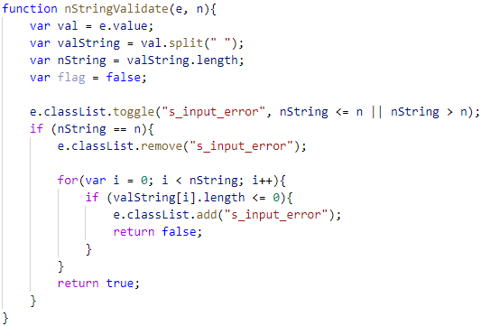
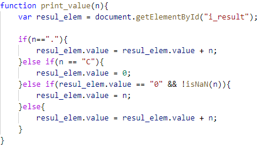

### CARRERA: Computación	ASIGNATURA: Programación Hipermedial
### NRO. PRÁCTICA:	3	TÍTULO PRÁCTICA: Resolución de problemas sobre JavaScript
### OBJETIVO ALCANZADO:
- Entender y organizar de una mejor manera los sitios de web en Internet
- Diseñar adecuadamente elementos gráficos en sitios web en Internet.
- Crear sitios web aplicando estándares actuales.

# ACTIVIDADES DESARROLLADAS
### 1.	El desarrollo de cada uno de los requerimientos descritos. 

#### Formulario

Se diseñó una interfaz en HTML que permita ingresar los siguientes campos en un formulario: cedula, nombres, apellidos, dirección, teléfono, fecha de nacimiento, correo electrónico y contraseña. 

Se usó funciones de JavaScript para validar que todos los campos han sido ingresados, además; que los valores ingresados en cada campo del formulario sean correctos teniendo en cuenta las siguientes condiciones:

###### Funciones Generales:
Para realizar las validaciones, se optó por crear funciones específicas para que puedan ser utilizadas por otras funciones.

Función que permite el ingreso de solo números, para lo cual se envía el evento onkeypress para evitar que la palabra se registre dentro del input tipo text, la misma lógica se usó para el ingreso de solo texto.

Función que permite solo el ingreso de texto.

 

Función que permite el ingreso de un determinado número de caracteres.

##### Validaciones:

Se usaron los eventos onkeypress, onkeyup y onblur para llamar a las respectivas funciones y lograr las validaciones en tiempo real, las cuales se llaman desde el archivo HTML.

Para cada validación se optó por crear dos funciones, una que se llama mientras el usuario está escribiendo (onkeypress u onkeyup), y la otra agrega a los respectivos divs de cada campo la clase “s_show”. Esta última función es llama para la validación general cuando se envíen los datos.

##### a.	Se debe validó que, en el campo de la cedula, se ingrese sólo números y que la misma sea correcta, en base, al último dígito verificador.

##### En HTML: 

 

#### En JavaScript:

Esta función valida el numero de cédula con respecto al último dígito.

Esta función agrega o elimina la clase “s_show” de la etiqueta div que contiene las pautas de validación.

 

##### b.   Se validó que, en el campo de nombres, ingrese exclusivamente dos nombres y que permita ingresar sólo letras, por ejemplo: “Gabriel Alejandro”, es válido; “Gabriel”, no es válido.

##### En HTML:

 

##### En JavaScript:

Función que valida el número de nombres ingresados. Esta función también es llamada para los apellidos. 

 

Esta función agrega o elimina la clase “s_show” de la etiqueta div que contiene las pautas de validación.

 

##### c.   Se validó que, en el campo de apellidos, ingrese exclusivamente dos apellidos y que permita ingresar sólo letras, por ejemplo: “León Paredes”, es válido; “León”, no es válido.

##### En HTML:

  

##### En JavaScript:

Para validar el número de apellidos se llama a la función nStringValidate().

  

Esta función agrega o elimina la clase “s_show” de la etiqueta div que contiene las pautas de validación.

##### d.   Se validó que, en el campo del teléfono, permita ingresar sólo números y un máximo de 10 caracteres numéricos.

##### En HTML:
 
  

##### En JavaScript:

Función que valida la cantidad números ingresados.
 

Esta función agrega o elimina la clase “s_show” de la etiqueta div que contiene las pautas de validación.
 

##### e.	Se validó que, la fecha de nacimiento ingrese en el formato dd/mm/yyyy.

##### En HTML:

Para el ingreso de fechas se valida que se ingresen solo números, además del carácter “/” con la función “dateDelimiter(event)”.

 

##### En JavaScript:

Función que valida el formato de fecha dd/mm/yyyy ó d/m/yyyy.

 

Esta función agrega o elimina la clase “s_show” de la etiqueta div que contiene las pautas de validación.

 
 
##### f.	Se validó que, en el campo correo electrónico, permita ingresar un correo válido. Se consideró como un correo válido, cuando comienza por tres o más valores alfanuméricos, luego un @, seguido por la extensión “ups.edu.ec” o “est.ups.edu.ec”.

##### En HTML:

  

##### En JavaScript:

Esta función valida el formato del correo electrónico, permitiendo el dominio “est.ups.edu.ec” ó “ups.edu.ec” y mínimo de 3 caracteres para le nombre de usuario.

  

Esta función agrega o elimina la clase “s_show” de la etiqueta div que contiene las pautas de validación.

  

##### g.	Se validó que, la contraseña ingresada tenga mínimo 8 caracteres, además, debe incluir al menos: una letra mayúscula, una letra minúscula y un carácter especial (@, _, $)

##### En HTML:

   

##### En JavaScript:

Esta función valida el formato o las pautas necesarias para validar la contraseña.

 

Esta función agrega o elimina la clase “s_show” de la etiqueta div que contiene las pautas de validación.

 

##### h.	Validación de que el campo dirección no esté vacío.

##### En HTML:

 

##### En JavaScript:

Valida si el campo está vacío.

 
 
Esta función agrega o elimina la clase “s_show” de la etiqueta div que contiene las pautas de validación.

 

##### i.	Validación para “enviar” y abrir el documento PHP.

##### En HTML:

Input de tipo “submit”.

 

En la etiqueta “form”, se especificó el evento “obsubmit” para evitar el envío al documento PHP en caso de que no se cumplan con las validaciones, en el evento “action” se especificó el nombre del archivo PHP que debe abrir y enviar la información. Finalmente, el método “POST” para obtener los valores de cada “input”.

  

##### En JavaScript:

La siguiente función valida que todos los campos cumplan con las validaciones, para lo cual, se creó una variable “flag” que va a contener lo que los métodos retornen, finalmente se procede a hacer una operación “and”, para asegurar que se retorne solo si se cumplen todas las validaciones.
 
 

##### j.	Archivo PHP.

 

#### Galería

Se diseñó una interfaz en HTML que tiene tres botones “Anterior”, “Iniciar”, “Siguiente”, y una imagen. Desde JavaScript se controló para que al hacer clic sobre uno de los botones realice una acción relacionada a una galería de imágenes, esto incluye animaciones de desplazamiento.

###### En HTML:

En el apartado HTML, se agregaron los tres botones con el evento “onclick” para llamar a la respectiva función que realiza la animación y el cambio de imágenes. También en el “body” se implementó el evento “onload” que llama a las funciones para hacer una carga inicial de imágenes y centrarlas.

 

###### En JavaScript:

Variables donde se almacenarán las rutas de cada imagen.

 

Función para escoger de manera aleatoria cinco imágenes de las diez que se mostrarán en la galería de imágenes.

 

Función que se llama desde el botón siguiente o anterior para cambiar la imagen presentada.

 

Al hacer clic en el botón siguiente y haber llegado a la última imagen disponible, el botón siguiente de deshabilita.

 

Al hacer clic en el botón anterior y haber llegado a la primera imagen disponible y cuando se inicie la galería, el botón anterior se deshabilita.

 

El cambio de imágenes simula un efecto de empuje, para lo cual, se usó la propiedad left. A continuación, solo se mostrará la animación “siguiente”, la animación para “anterior” tiene la misma lógica. Esta función prepara la animación, creando y asignando las variables de ubicación en pixeles. Cabe recalcar que se usó el estilo “position: absolute” desde CSS para que permita manipular las ubicaciones sin problemas.
 
 

La siguiente función tiene la finalidad de ser un controlador de posiciones, ya se llama por intervalos, lo que provoca que su proceso sea iterativo. 

Se encarga de sumar o restar la propiedad “left” tanto para las animaciones izquierda y derecha, por lo que hace validaciones de posición de la imagen principal, con el id “img_main”, y la auxiliar con el id “img_aux”. Esta dota de un efecto de empuje en el cambio de imágenes.
 
 

Resta la posición “left”.

  

Suma la posición “left”.

  

#### Calculadora

Se realizó una calculara en HTML usando botones de JavaScript y una caja de texto para visualizar el resultado. Las operaciones que puede realizar son: suma, resta, multiplicación y división. Además, de poder limpiar la memoria de la calculadora. Por último, se debe usar la función eval() para realizar las operaciones aritméticas.

###### En HTML:

Cada botón llama a la función “print_value” y envía el atributo “value” del “input” con el evento “onclick”, se presentan cinco como ejemplo de estructura, ya que todos los botones tienen la misma lógica.

  

###### En JavaScript:

Esta función se encarga de “pintar” o asignar al atributo “value” el valor que ingresó a este. También hace las validaciones para limpiar la pantalla y así limpiar la memoria. 

  

Finalmente, esta función realiza los cálculos usando la función “eval()” y controla la división para 0.

  

### 2.	La evidencia del correcto diseño de las páginas HTML usando CSS. Para lo cual, se puede generar fotografías instantáneas (pantallazos). 

#### Formulario

  

#### Galería

  

#### Calculadora 

  

### 3.	La evidencia del correcto funcionamiento de las funciones de JavaScript.

#### Formulario

Errónea: validación de la cédula, nombres y apellidos.

  
 
Correcta:

   

Errónea: validación de la dirección, teléfono y fecha de nacimiento.

   

Correcta:

   

Errónea: Validación de Email y contraseña.

   

Correcta:

  

PHP:

  

#### Galería

 
 
 

 

#### Calculadora

 

### 4.	Incluir la información de GitHub (usuario y URL del repositorio de la práctica).

Nombre de usuario: czhizhpon  
Enlace: https://github.com/czhizhpon/Practica03-Javascript.git

### RESULTADO(S) OBTENIDO(S):

Para realizar la práctica, se tuvo que organizar de una mejor manera los sitios de web en Internet, para el correcto funcionamiento de las funciones en JavaScript y estilos CSS para el diseño de la página.

### CONCLUSIONES:

JavaScript se acopla muy bien con HTML y CSS, todo lo que se ha venido aprendiendo con anterioridad, se puede sacar mucho provecho si lo hacemos de una manera interactiva con el usuario, lo que resulta muy útil como en la validación de procesos o formularios.

### RECOMENDACIONES:

Revisar la documentación de JavaScript y las clases que se impartieron.

###### Nombre de estudiante: Zhizhpon Tacuri Cesar Eduardo

###### Firma de estudiante:  
